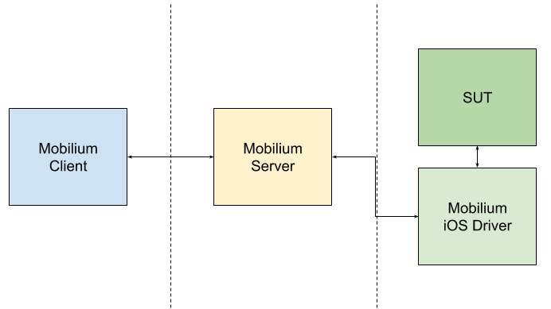
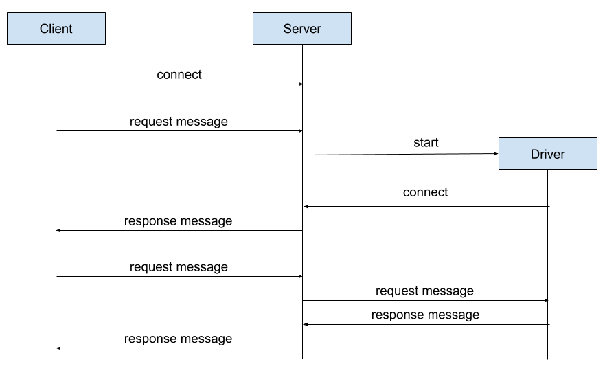

# Mobilium framework architecture

#### Components
- **Mobilium Server** - core of the Mobilium project. This application written in python is a gate for communication between Client and Driver. In addition, Server is responsible for running MobiliumDriver on device/simulator.
- **Mobilium iOS Driver** - UI Test executor. This component has implementation of our testing procedures, and it is runned on the iOS device. It is directly testing System Under Test (SUT), which will be your iOS application.
- **Mobilium Client** - UI Test runner where we manage whole testing process, request application and environment changes on server and communicate through the system with SUT

#### Components communication
We used WebSockets to allow communication between components. WebSockets ensure quick, reliabe two way communication.
Following diagram represents how communication flow is achived. Imporant note is that, that client is never directly sending messages to thee iOS driver, instead client sends request to the server, which will decided if this request should be handled by the server or procceed to the driver directly.

#### Proto models

All communication between components is based on request/response model.
This means that at the time, there is only one request performed by client, and client is waiting for a response dedicated for that request.

To unify all messages (request/response) we've decided to use [Google proto](https://developers.google.com/protocol-buffers).

All framework components are using one, shared proto models. Those models are defined inside `proto/messages.proto`.

For Client/Server we are using messages generated for python.
iOS driver is using Swift proto message definitions
